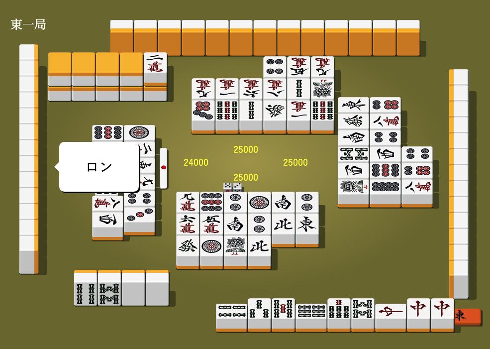
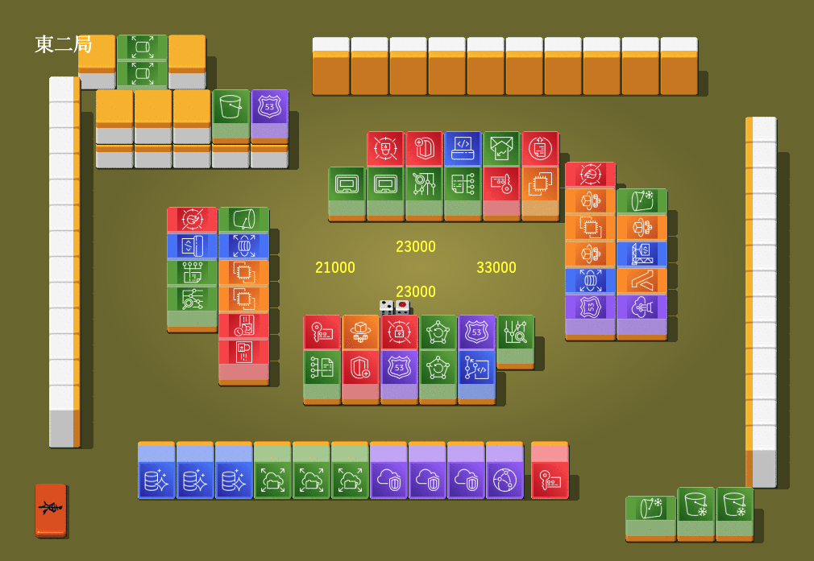
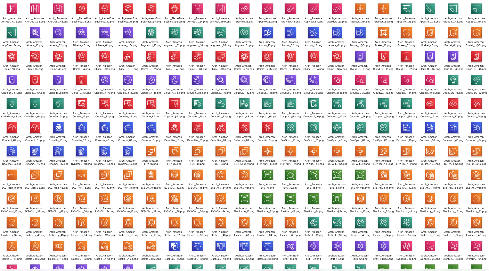
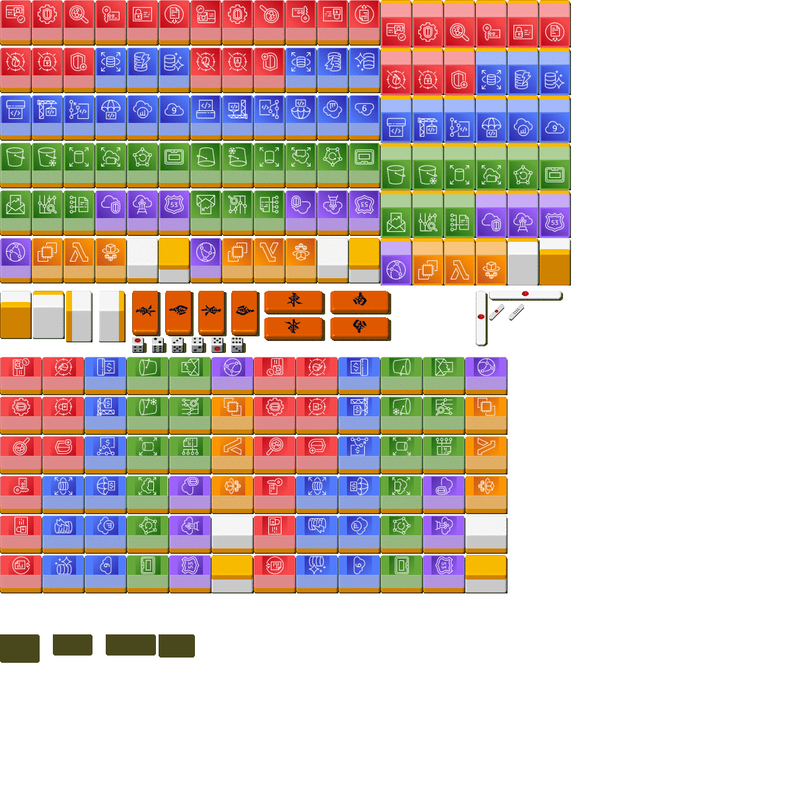

# AWSサービスのアイコンで麻雀してみた
| Before | After |
| ---- | ---- |
|    |    |

https://www.gamedesign.jp/flash/mahjong/mahjong.html

## きっかけ・・・
AWSのサービスアイコンが200種類以上並んでいる図を見たときのこと。

自分「うわーいっぱいあるな・・・」

自分「そういえばAWSのアイコンってしっかりと**ジャンルごとに色分け**されてるんやなー」

自分「（あれ・・・？？なんかこういうの見たことあるな）」

自分「（あっ！！！！）」

自分「（これ、**麻雀**と同じや！）」

自分「（**AWSのアイコンで麻雀できるやん！！！**）」

## やったこと
[こちらのサイト](https://www.gamedesign.jp/flash/mahjong/mahjong.html)の麻雀牌の画像を、[mitmproxy](https://github.com/mitmproxy/mitmproxy)を使って差し替えて遊びました。

麻雀牌の画像は、元の画像とAWSのアイコンデータから自分で作成しました。
| Before | After |
| ---- | ---- |
|    |    |

## 開発した感想
- 自分が思い描いたアイデアを形にできた、**嬉しさ・達成感**
- ~~アホらしいことをしたけど~~**意外と学びが多かった**
  - HTTPリクエスト・レスポンスの仕組み
  - 画像データってどうやって送受信してるの？
  - 初めてプロキシを触った
  - 初めてChrome拡張機能を開発した
- 社内で技術的な質問をすると回答をもらえるありがたみ
